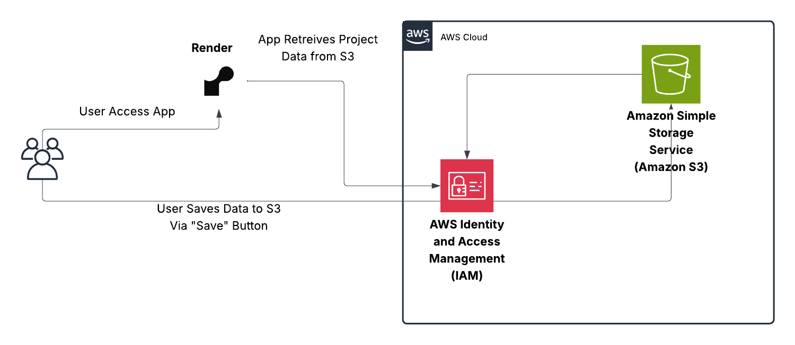

## Dune Awakening: Colalborative Crafting Tracker

A web-based resource tracker for Dune: Awakening, built with Flask and hosted on [Render](https://render.com). 
Backend save-state is stored on AWS S3, so your data persists across sessions, even when using the free Render Hobby tier (which spins down after inactivity).

---

##  Features

-  Track how much of each resource you have vs how many you need for group projects
-  Add new resources or full crafting projects
-  Data is saved in S3 using `projects.json`
-  Hosted for free on Render with free-tier auto-persistent storage via AWS

---

## Architecture Overview

---

##  AWS Setup
1. Uses a free tier S3 Bucket to load and save json file.
2. If the backend file is missing, the app default to our first example project. No extra hassle for first time loads.
3. I chose to utilize an IAM user, access Key and Secret Access Key.
4. IAM policy must atleast allow:

+ s3:GetObject

+ s3:PutObject

+ s3:ListBucket

- **S3 Permissions are always a hassle, so you may need more.**
- **Note, there are security implications with any method of authentication you choose. Use AWS responsibly**

##  Render Environment Variables
- **AWS_ACCESS_KEY_ID:**	AWS access key for the S3 IAM user
- **AWS_SECRET_ACCESS_KEY**	AWS secret key for the S3 IAM user
- **AWS_DEFAULT_REGION** Ensure Region is the same as your Render Region.
- **S3_BUCKET_NAME**	The name of the S3 bucket that holds projects.json
- **USE_S3**	true to use S3 for storage, false for local file testing.
- **FLASK_APP** Band-aid fix for processing issues. Flask struggles.
- **FLASK_ENV** Band-aid fix for processing issues. I'm no flask expert.

Future Ideas
 - Item Library to link and propagate crafting needs without manual entry
 - Auto-save feature to avoid needing to click "Save Progress"
 - Export to CSV option
 - Mobile Support
 - UI overhaul and design pass
